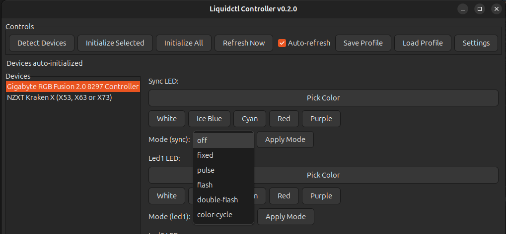
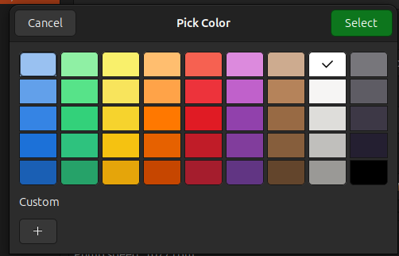
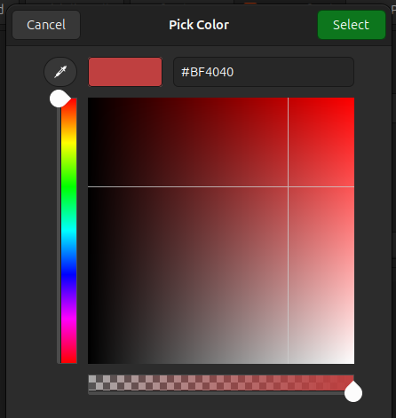

# liquidctl-gui

[](https://opensource.org/licenses/MIT)
[](https://github.com/amatson97/liquidctl-gui)

**Version 0.2.0** — [Changelog](CHANGELOG.md)

A GTK GUI for controlling liquidctl-compatible devices. Dynamically detects and configures supported hardware with automatic initialization and persistent settings.

Credit: built on top of https://github.com/liquidctl/liquidctl

---

## ⚠️ Important Safety Warning

**USE AT YOUR OWN RISK** — This application directly controls hardware cooling and lighting systems. Improper configuration may lead to:
- Hardware overheating and thermal damage
- Reduced component lifespan
- System instability or crashes
- Voided warranties

**NO LIABILITY** — The project owner and contributors accept **NO RESPONSIBILITY** for any hardware damage, data loss, or other consequences resulting from the use of this software. You assume all risks associated with modifying your hardware settings.

**SAFETY FEATURES IN DEVELOPMENT** — Automatic thermal safety monitoring and override systems are planned but **not yet implemented**. Until these features are available, users must manually monitor system temperatures and ensure cooling settings are adequate for their hardware.

**RECOMMENDATIONS:**
- Always monitor temperatures when changing cooling settings
- Start with conservative (higher) pump/fan speeds and reduce gradually
- Keep manufacturer software installed as a backup
- Test new settings under load and verify thermal performance
- Know your hardware's safe operating temperature ranges

---

## Screenshots

### Main Interface


### LED Mode Selection


### Color Picker


#### Custom Color Picker


## Features
- **Dynamic device detection** with automatic capability discovery
- **Auto-initialization on startup** — devices are ready to use immediately
- **Persistent device configurations** — UI loads with all controls on every launch
- **LED color control** with mode selection (fixed, breathing, pulse, spectrum-wave, etc.)
- **Pump and fan speed control** (0-100%)
- **Live status monitoring** with auto-refresh for supported devices
- **Profile save/load** for quick settings restoration
- **Settings dialog** for customizing auto-initialization and refresh intervals
- **No manual setup required** after first detection

## Requirements
- Python 3
- GTK 3 bindings (python3-gi, gir1.2-gtk-3.0) — installable via your distro package manager

## Setup (recommended)
Run the provided launcher script which will create a virtual environment, install the Python-only prerequisite (`liquidctl`) into it, and check for the GTK system bindings:

```bash
./launch.sh
```

Notes:
- The launcher will create a `.venv` in the repo root and `pip install liquidctl` into it.
- GTK system bindings (`python3-gi` / `gir1.2-gtk-3.0`) are installed via your distro package manager; the launcher can prompt and run `sudo apt-get install` on Debian/Ubuntu systems.
- If you prefer manual setup, create a venv and `pip install liquidctl` as before.

Hardware access notes:

- Some operations require access to kernel hwmon/sysfs nodes. See [docs/SETUP.md](docs/SETUP.md) for udev rules and options to avoid running the GUI as root.

## Run
```
PYTHONPATH=src python -m liquidctl_gui
```

## Tests
```bash
PYTHONPATH=src python -m unittest tests.test_unit
```

### Testing with Simulated Devices
For development and testing without physical hardware, you can use simulated devices:

```bash
LIQUIDCTL_SIMULATE=1 PYTHONPATH=src python -m liquidctl_gui
```

This will use mock devices defined in `tests/mock_devices.py` instead of scanning for real hardware.

## Why GTK
- Native look on Linux desktops without bundling a web stack.
- Solid widgets for a small, responsive hardware control panel.

Notes:
- Some devices require sudo access. If you see permission errors, run with sudo or set up udev rules for your hardware.
- Close NZXT CAM if it is running to avoid device conflicts.

## Configuration
User configuration is stored at `~/.liquidctl-gui/config.json`.
- **First run**: Detects devices and saves their full capabilities (channels, modes, etc.)
- **Subsequent launches**: Automatically loads devices with all controls ready
- **Device capabilities** are refreshed on each startup to ensure accuracy
- **Auto-initialization** happens automatically (configurable in Settings)

Optional profile support:
- Save current settings via "Save Profile" button
- Load profiles via "Load Profile" button
- Auto-loaded from `~/.liquidctl-gui/example.json` if present

### Settings Dialog
Click the "Settings" button to configure:
- **Auto-initialize on startup** — automatically initialize all devices when the app starts
- **Auto-refresh interval** — how often to update device status (1-60 seconds)

## How It Works
When liquidctl is installed via pip, the GUI uses the Python API directly to:
- Discover connected devices
- Extract supported color channels, speed channels, and LED modes from drivers
- Build dynamic UI controls for each device's capabilities

This means the GUI automatically supports any device that liquidctl supports, without needing manual configuration.

## Device Notes
- Some devices only support lighting (no status reporting)
- Devices with cooling support report pump/fan RPM and temperatures
- See [liquidctl docs](https://github.com/liquidctl/liquidctl/tree/main/docs) for device-specific details

## Contributing
Contributions are welcome! Please see [CONTRIBUTING.md](CONTRIBUTING.md) for guidelines.

## Releasing

For maintainers: Use the automated release scripts in [scripts/](scripts/):

```bash
# Interactive release wizard
./scripts/prepare-release.sh

# Or direct release
./scripts/release.sh 0.3.0
```

See [scripts/README.md](scripts/README.md) for details.

## Recent Updates (v0.2.0)
- ✅ **Auto-initialization on startup** — devices initialize automatically
- ✅ **Persistent device capabilities** — full UI loads without clicking "Detect Devices"
- ✅ **Settings dialog** — configure auto-init and refresh intervals
- ✅ **Enhanced config management** — device capabilities saved and restored
- ✅ **Improved startup flow** — app is ready to use immediately

## Roadmap
- **[CRITICAL]** Thermal safety monitoring with automatic override of unsafe cooling settings during critical temperature conditions
- **[HIGH]** Fan curve editor for advanced cooling control
- **[MEDIUM]** System tray integration with quick controls
- **[MEDIUM]** Per-device profile management
- **[LOW]** Additional effect presets and animations
- **[LOW]** GUI visual improvements and theming

**Priority Levels:**
- **CRITICAL** — Essential for hardware safety and protection
- **HIGH** — Important features that significantly improve functionality
- **MEDIUM** — Useful enhancements that improve user experience
- **LOW** — Nice-to-have features and cosmetic improvements

## License
MIT License - see [LICENSE](LICENSE) for details
